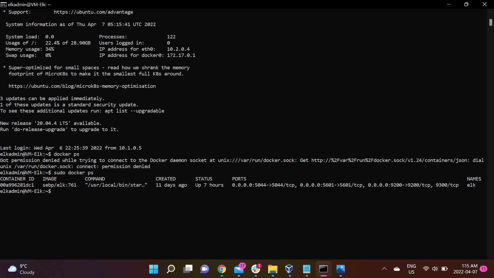

# CarlaBente-ELK
Configuring an ELK Stack server in order to set up a cloud monitoring system.
## Automated ELK Stack Deployment

The files in this repository were used to configure the network depicted below.

These files have been tested and used to generate a live ELK deployment on Azure. They can be used to either recreate the entire deployment pictured above. Alternatively, select portions of the _____ file may be used to install only certain pieces of it, such as Filebeat.

  - carla_playbook.yml
  - pentest.yml
  - ansible.config
  - elk.yml
  - metricbeat-config.yml
  - filebeat-config.yml
  - metricbeat-playbook.yml
  - filebeat-playbook.yml

This document contains the following details:
- Description of the Topologu
- Access Policies
- ELK Configuration
  - Beats in Use
  - Machines Being Monitored
- How to Use the Ansible Build

### Description of the Topology

The main purpose of this network is to expose a load-balanced and monitored instance of DVWA, the D*mn Vulnerable Web Application.

Load balancing ensures that the application will be highly redundant, in addition to restricting traffic to the network.
- Load balancers protect availability of services in CIA. Load balancers have the ability to distribute network traffic amongst multiple servers, making services more efficient and reliable in case of a technical failure.
- The purpose of a jump box in this scenario is to enable only one port to connect to different virtual machines. This makes it easier for us to monitor incoming and outgoing traffic. 

Integrating an ELK server allows users to easily monitor the vulnerable VMs for changes to the network and system logs.
- Filebeat monitors log files or locations specified such as audit logs, deprecation logs, gc logs, server logs and slow logs used to be sent to Elasticsearch.
- Metricbeat records modules and metricsets, which includes system-level CPU usage, memory, file system, disk IO and network IO statistics.

The configuration details of each machine may be found below.

| Name    | Function             | IP Address | Operating System |
|---------|----------------------|------------|------------------|
| JumpBox | Gateway              | 10.1.0.5   | Linux            |
| Web1    | Web Application DVWA | 10.1.0.5   | Linux            |
| Web2    | Web Application DVWA | 10.1.0.6   | Linux            |
| VM-Elk  | Elk Server           | 10.2.0.4   | Linux            |

### Access Policies

The machines on the internal network are not exposed to the public Internet. 

Only the jump box machine can accept connections from the Internet. Access to this machine is only allowed from the following IP addresses:
- My public IP: 216.181.205.144

Machines within the network can only be accessed by my public IP (personal workstation).
- The jumpbox is able to access my ELK VM through port 22 (SSH). JumpBox Private IP is 10.1.0.5 and ELK VM Private IP is 10.2.0.4

A summary of the access policies in place can be found in the table below.

| Name    | Publicly Accessible | Allowed IP Addresses |
|---------|---------------------|----------------------|
| JumpBox | Yes                 | 216.181.205.144      |
| Web1    | No                  | 10.1.0.5             |
| Web2    | No                  | 10.1.0.6             |
| VM-Elk  | Yes                 | 216.181.205.144      |

### Elk Configuration

Ansible was used to automate configuration of the ELK machine. No configuration was performed manually, which is advantageous because...
- Automating configurations with ansible is advantageous because it has the ability to automate repetitive and tedious tasks. Ansible allows users to deploy multi tier applications without having to write code, it is able to read the playbook and modify your system in the states specified.  

The playbook implements the following tasks:
- First, the playbook installs a docker.io using the apt command which stands for aptitude (an interface that allows a user to install packages on Linux), this is the package used by Ubuntu needed in order to deploy applications
- Next, we install python3-pip which is needed to install the modules in the docker file
- We are now able to use pip in order to install the docker module, which gives us the ability to create a container inside the VM
- Now we are able to run the ELK stack through the docker container, and here we are able to specify which ports we would like to be accessible. Note that in this step, we allowed port 5601 to be opened, as this is how we will access the Kibana application.

The following screenshot displays the result of running `docker ps` after successfully configuring the ELK instance.

### Target Machines & Beats
This ELK server is configured to monitor the following machines:
- Web1: 10.1.0.6
- Web2: 10.1.0.7

We have installed the following Beats on these machines:
- Filebeat

- Metricbeat

These Beats allow us to collect the following information from each machine:
- Filebeat: allows us to collect log files from the VMs Web1 and Web2 and display them in a user-friendly format on Kibana. For example, we are able to see the types of errors users experience in these 2 VMs (ex. error 200, 404 and 503) and this is displayed in a GUI format using graphs in Kibana.
- Metricbeat: allows us to collect metric data and statistics from VMs web1 and Web2. For example. we are able to see how many bytes are ran by the second from these 2 servers when accessing Kibana, and they are shown on a user-friendly bar graph. and 

### Using the Playbook
In order to use the playbook, you will need to have an Ansible control node already configured. Assuming you have such a control node provisioned: 

SSH into the control node and follow the steps below:
- Copy the elk.yml file to /etc/ansible.
- Update the hosts file to include the host name and IP address.
- Run the playbook, and navigate to Kibana using the Elk's Public IP through port 5601 to check that the installation worked as expected.

- Which file is the playbook? elk.yml Where do you copy it? /etc/ansible
- Which file do you update to make Ansible run the playbook on a specific machine? hosts file How do I specify which machine to install the ELK server on versus which to install Filebeat on? Specify the ELK server's private IP in the hosts file
- _Which URL do you navigate to in order to check that the ELK server is running? Navigate to http://(ELK's Public IP):5601/app/Kibana
